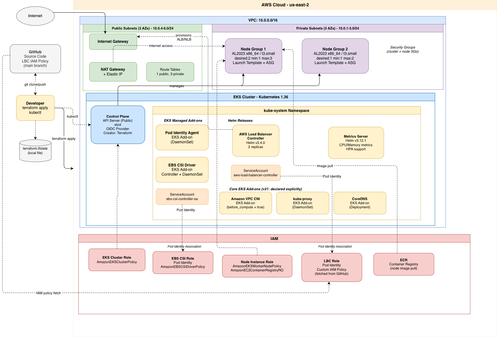

# EKS Starter — Terraform

Terraform configuration for a production-ready [Amazon EKS](https://docs.aws.amazon.com/eks/latest/userguide/what-is-eks.html) cluster, including VPC networking, managed node groups, EBS CSI driver, AWS Load Balancer Controller, and External Secrets Operator — all wired up via [EKS Pod Identity](https://docs.aws.amazon.com/eks/latest/userguide/pod-identities.html).

Originally forked from [HashiCorp's EKS tutorial](https://developer.hashicorp.com/terraform/tutorials/kubernetes/eks) and extended with additional add-ons, variable-driven configuration, and production patterns for research and exploration.

---

## Documentation

| Document | Description |
|---|---|
| [AWS Load Balancer Controller — Implementation](./docs/lbc-implementation.md) | Design decisions and configuration for the LBC add-on. |
| [External Secrets Operator — Implementation](./docs/eso-implementation.md) | Design decisions and configuration for the ESO add-on. |
| [VPC CNI — NetworkPolicy Enforcement](./docs/vpc-cni-network-policy-implementation.md) | Why `NetworkPolicy` enforcement must be explicitly enabled, and how to verify it. |

---

## Architecture



## Overview

`terraform apply` provisions ~80 resources across five logical groups:

### VPC & Networking

Uses [`terraform-aws-modules/vpc/aws`](https://registry.terraform.io/modules/terraform-aws-modules/vpc/aws/latest) v6.6.1.

| Resource | Count | Notes |
|---|---|---|
| VPC | 1 | `/16` CIDR, DNS hostnames enabled |
| Private subnets | 3 | One per AZ, tagged for internal ELB |
| Public subnets | 3 | One per AZ, tagged for public ELB |
| Internet gateway | 1 | Attached to the VPC |
| NAT gateway | 1 | Single gateway (cost-optimized) in a public subnet |
| Elastic IP | 1 | Allocated for the NAT gateway |
| Route tables | 4 | 1 public + 3 private (one per AZ) |

### EKS Cluster & Node Groups

Uses [`terraform-aws-modules/eks/aws`](https://registry.terraform.io/modules/terraform-aws-modules/eks/aws/latest) v21.19.0.

| Resource | Notes |
|---|---|
| EKS control plane | Public endpoint, Kubernetes 1.36 by default |
| OIDC provider | For [IAM Roles for Service Accounts (IRSA)](https://docs.aws.amazon.com/eks/latest/userguide/iam-roles-for-service-accounts.html) |
| Managed node group 1 | `node-group-1`: desired 2, min 1, max 3 |
| Managed node group 2 | `node-group-2`: desired 1, min 1, max 2 |
| Launch templates | One per node group |
| Security groups | Cluster + node groups |
| IAM roles & policies | Cluster role, node instance role |
| [Amazon VPC CNI](https://docs.aws.amazon.com/eks/latest/userguide/managing-vpc-cni.html) add-on | Pod networking; installed before nodes join (`before_compute = true`); `NetworkPolicy` enforcement explicitly enabled — see [implementation notes](./docs/vpc-cni-network-policy-implementation.md) |
| [`kube-proxy`](https://docs.aws.amazon.com/eks/latest/userguide/managing-kube-proxy.html) add-on | Cluster service networking |
| [CoreDNS](https://docs.aws.amazon.com/eks/latest/userguide/managing-coredns.html) add-on | In-cluster DNS |
| [EKS Pod Identity agent](https://docs.aws.amazon.com/eks/latest/userguide/pod-id-agent-setup.html) add-on | Installed via cluster add-on |
| [AWS EBS CSI driver](https://docs.aws.amazon.com/eks/latest/userguide/ebs-csi.html) add-on | Installed via cluster add-on |

> **Module v21 note:** v21 sets `bootstrap_self_managed_addons = false`, so EKS no longer auto-installs VPC CNI, `kube-proxy`, and CoreDNS. They are declared explicitly as managed add-ons in [`main.tf`](./main.tf); omitting them leaves nodes stuck `NotReady` with no CNI.

### EBS CSI Driver — Pod Identity

| Resource | Notes |
|---|---|
| IAM role `AmazonEKSTFEBSCSIRole-<cluster>` | Assumed by the EBS CSI controller pod |
| IAM policy attachment | `AmazonEBSCSIDriverPolicy` (AWS managed) |
| Pod Identity association | Binds `ebs-csi-controller-sa` in `kube-system` to the IAM role |

### AWS Load Balancer Controller — Pod Identity

| Resource | Notes |
|---|---|
| IAM policy `AWSLoadBalancerControllerIAMPolicy-<cluster>` | Fetched from LBC `main` branch (tagged releases have missing permissions) |
| IAM role `AmazonEKSTFLBCRole-<cluster>` | Assumed by the LBC pod via Pod Identity |
| Pod Identity association | Binds `aws-load-balancer-controller` SA in `kube-system` to the IAM role |
| Helm release `aws-load-balancer-controller` | Installed from `eks/aws-load-balancer-controller` chart |

### External Secrets Operator — Pod Identity

| Resource | Notes |
|---|---|
| IAM policy `ExternalSecretsOperatorIAMPolicy-<cluster>` | Secrets Manager + SSM Parameter Store read permissions |
| IAM role `AmazonEKSTFESORRole-<cluster>` | Assumed by the ESO pod via Pod Identity |
| Pod Identity association | Binds `external-secrets` SA in `external-secrets` namespace to the IAM role |
| Helm release `external-secrets` | Installed from `charts.external-secrets.io` chart |

---

## Prerequisites

| Tool | Version | Install |
|---|---|---|
| [Terraform](https://developer.hashicorp.com/terraform/install) | >= 1.5.7 | `brew install terraform` |
| [AWS CLI](https://docs.aws.amazon.com/cli/latest/userguide/getting-started-install.html) | v2 | `brew install awscli` |
| [kubectl](https://kubernetes.io/docs/tasks/tools/) | compatible with cluster version | `brew install kubectl` |

Your AWS credentials must have permission to create IAM roles, VPCs, EKS clusters, EC2 instances, and related resources. The Terraform caller is automatically granted `cluster-admin` via `enable_cluster_creator_admin_permissions = true`.

---

## Quickstart

**1. Clone and enter the repo**

```bash
git clone <repo-url>
cd eks-starter
```

**2. Configure variables**

```bash
cp terraform.tfvars.example terraform.tfvars
# Edit terraform.tfvars — at minimum, set region and cluster_name_prefix
```

**3. Initialize Terraform**

```bash
terraform init
```

**4. Review the plan**

```bash
terraform plan
```

**5. Apply**
Enter `yes` when prompted.

```bash
terraform apply
```

Provisioning takes approximately 15–20 minutes. If everything succeeds you should see something like:
```
...
Apply complete! Resources: 75 added, 0 changed, 0 destroyed.

Outputs:

cluster_endpoint = "https://<VERY_LONG_IDENTIFIER>.gr7.us-east-2.eks.amazonaws.com"
cluster_name = "eks-starter"
cluster_security_group_id = "sg-0123456789abcdef0"
region = "us-east-2"
```

**6. Configure kubectl config**

```bash
aws eks --region $(terraform output -raw region) update-kubeconfig \
  --name $(terraform output -raw cluster_name)
```

**7. Apply the ClusterSecretStores (External Secrets Operator)**

`terraform apply` installs ESO itself, but not the `ClusterSecretStore` resources — those are CRDs
that must be applied after the ESO Helm release exists. Without this step, ESO is running but
`ExternalSecret` objects have nothing to reference.

```bash
REGION=$(terraform output -raw region)

kubectl apply -f - <<EOF
apiVersion: external-secrets.io/v1
kind: ClusterSecretStore
metadata:
  name: aws-secrets-manager
spec:
  provider:
    aws:
      service: SecretsManager
      region: ${REGION}
---
apiVersion: external-secrets.io/v1
kind: ClusterSecretStore
metadata:
  name: aws-ssm-parameter-store
spec:
  provider:
    aws:
      service: ParameterStore
      region: ${REGION}
EOF
```

See [External Secrets Operator — Implementation](./docs/eso-implementation.md#post-provision-apply-the-clustersecretstores)
for why these have no `auth` section (Pod Identity) and for `ExternalSecret` usage examples.

**8. Verify**

Run these checks in order after `terraform apply` completes. Each builds on the previous.

**Nodes — all Ready**
```bash
kubectl get nodes
```
> Expected: 3 nodes (2 from node-group-1, 1 from node-group-2), all STATUS=Ready

**System pods — all Running**
```bash
kubectl get pods -n kube-system
```
> Expected: all pods Running/Completed, none in Pending/CrashLoopBackOff/Error

**EBS CSI driver — Pod Identity wired up**

Controller and node pods running
```bash
kubectl get pods -n kube-system -l app=ebs-csi-controller
```
```bash
kubectl get pods -n kube-system -l app=ebs-csi-node
```

Pod Identity association exists
```bash
aws --no-cli-pager eks list-pod-identity-associations \
  --cluster-name $(terraform output -raw cluster_name) \
  --region $(terraform output -raw region) \
  --query 'associations[?serviceAccount==`ebs-csi-controller-sa`]'
```
> Expected: one entry with namespace=kube-system

**AWS Load Balancer Controller — healthy and watching**

2 replicas running
```bash
kubectl get deployment -n kube-system aws-load-balancer-controller
```
> Expected: `READY 2/2`

No errors in logs (look for "Starting", "successfully acquired lease")
```bash
kubectl logs -n kube-system \
  -l app.kubernetes.io/name=aws-load-balancer-controller \
  --tail=20
```

Pod Identity association exists
```bash
aws --no-cli-pager eks list-pod-identity-associations --cluster-name $(terraform output -raw cluster_name) --region $(terraform output -raw region) \
  --query 'associations[?serviceAccount==`aws-load-balancer-controller`]'
```
> Expected: one entry with namespace=kube-system

**External Secrets Operator — ClusterSecretStores ready**

Requires step 7 (Apply the ClusterSecretStores) to have been run first.
```bash
kubectl get clustersecretstore
```
> Expected: `aws-secrets-manager` and `aws-ssm-parameter-store`, both `STATUS=Valid READY=True`

**metrics-server — serving resource metrics**
```bash
kubectl get deployment -n kube-system metrics-server
```
> Expected: READY 1/1

```bash
kubectl top nodes
```
> Expected: CPU and MEMORY usage listed for each node (may take ~60s after first deploy)

**VPC CNI — `NetworkPolicy` enforcement enabled**

`status: ACTIVE` on the add-on is not enough to confirm this — check the config value landed:
```bash
aws --no-cli-pager eks describe-addon \
  --cluster-name $(terraform output -raw cluster_name) \
  --addon-name vpc-cni \
  --region $(terraform output -raw region) \
  --query 'addon.configurationValues'
```
> Expected: `"{\"enableNetworkPolicy\":\"true\"}"`

See [VPC CNI — NetworkPolicy Enforcement](./docs/vpc-cni-network-policy-implementation.md) for the
full functional test (apply a `NetworkPolicy`, confirm a `PolicyEndpoint` is created, confirm
traffic is actually blocked) — without it, applied `NetworkPolicy` objects are silent no-ops.

---

## Deploying with HCP Terraform

The Quickstart above runs Terraform locally. This config also deploys cleanly through [HCP Terraform](https://developer.hashicorp.com/terraform/cloud-docs) (formerly Terraform Cloud) using a **VCS-driven** workspace, where state lives remotely and runs execute on HCP's runners.

**1. Connect the repo and create a workspace**

In your HCP Terraform org: **Settings → Version Control** → authorize the GitHub app for this repo, then create a **Version Control Workflow** workspace pointing at it (working directory = repo root).

**2. Provide AWS credentials as _Environment_ variables**

The `aws` provider reads the standard AWS credential chain, so these must be **Environment variables** — *not* Terraform variables, or the provider never sees them:

| Key | Category | Sensitive |
|---|---|---|
| `AWS_ACCESS_KEY_ID` | env | no |
| `AWS_SECRET_ACCESS_KEY` | env | **yes** |
| `AWS_DEFAULT_REGION` | env | no |

Use a **dedicated IAM user** (or, better, [OIDC dynamic credentials](https://developer.hashicorp.com/terraform/cloud-docs/workspaces/dynamic-provider-credentials/aws-configuration)) — never the AWS root account.

**3. Set Terraform variables in the workspace**

Because `*.tfvars` is gitignored, set overrides like `cluster_name_prefix` as **Terraform variables** in the workspace UI instead of a committed `terraform.tfvars`. Defaults in [`variables.tf`](./variables.tf) apply for anything you don't override.

**4. Run and apply**

A push to the tracked branch queues a plan. Keep **Apply Method = Manual apply** (Workspace → Settings → General) so you review the plan before ~80 resources — and real cost — are created, then click **Confirm & Apply**. Provisioning takes ~15–20 minutes.

**5. Configure kubectl — note the differences from local**

`terraform output -raw ...` in the Quickstart **does not work locally** with HCP, since state is remote. Use the known values instead — `cluster_name` equals your `cluster_name_prefix`, and the region is your `AWS_DEFAULT_REGION` (or read both from the workspace **Outputs** tab):

```bash
aws eks --region <region> update-kubeconfig --name <cluster_name_prefix>
```

Because the apply runs as the workspace's IAM identity, **that identity — not your laptop — is the cluster creator/admin** (`enable_cluster_creator_admin_permissions = true`). To get `kubectl` access, either point a named AWS profile at the same key and pass `--profile <name>` to `update-kubeconfig`, or grant your own principal an EKS [access entry](https://docs.aws.amazon.com/eks/latest/userguide/access-entries.html).

**6. Teardown**

Follow the [Teardown](#teardown) steps below, but run **`terraform destroy` as a destroy run from the workspace** (Settings → Destruction and Deletion → Queue destroy plan) rather than locally, since state is remote.

---

## Variables

| Variable | Default | Description |
|---|---|---|
| `region` | `us-east-2` | AWS region to deploy into |
| `cluster_name_prefix` | `eks-starter` | Prefix for cluster and VPC names |
| `cluster_version` | `1.36` | [Kubernetes version](https://docs.aws.amazon.com/eks/latest/userguide/kubernetes-versions.html) |
| `ami_type` | `AL2023_x86_64_STANDARD` | [Node AMI type](https://docs.aws.amazon.com/eks/latest/userguide/managed-node-groups.html) |
| `instance_types` | `["t3.small"]` | EC2 instance types for both node groups |
| `vpc_cidr` | `10.0.0.0/16` | VPC CIDR block |
| `private_subnets` | `["10.0.1.0/24", ...]` | Private subnet CIDRs (one per AZ) |
| `public_subnets` | `["10.0.4.0/24", ...]` | Public subnet CIDRs (one per AZ) |
| `lbc_chart_version` | `3.4.0` | Helm chart version for the [AWS Load Balancer Controller](https://kubernetes-sigs.github.io/aws-load-balancer-controller/) |
| `eso_chart_version` | `2.6.0` | Helm chart version for [External Secrets Operator](https://external-secrets.io/) |
| `eso_secret_arns` | `["*"]` | AWS Secrets Manager ARN patterns ESO is permitted to read |

See [`terraform.tfvars.example`](./terraform.tfvars.example) for a ready-to-copy template.

---

## Outputs

| Output | Description |
|---|---|
| `cluster_name` | EKS cluster name |
| `cluster_endpoint` | API server endpoint URL |
| `cluster_security_group_id` | Security group attached to the control plane |
| `region` | AWS region |
| `eso_iam_role_arn` | IAM role ARN used by the External Secrets Operator |

---

## Teardown

### Pre destroy
Check for any ingress resources tied to AWS load balancers and delete if necessary. These LBs would get orphaned if not explicitly destroyed before cluster deletion.

```bash
kubectl get ingress --all-namespaces
```

If you see ingress resources, delete them first:
```bash
kubectl delete ingress -n <namespace> <ingress-name>
```

You might need to wait a few seconds before the command completes.

Confirm the associated AWS LBs were also deleted with this `aws` cli command:
```bash
aws --no-cli-pager elbv2 describe-load-balancers \
  --region $(terraform output -raw region) \
  --query 'LoadBalancers[*].LoadBalancerName' --output text
```

If there's no output then you should be clear to destroy the cluster.

### Destroy the cluster and associated resources

```bash
terraform destroy
```
